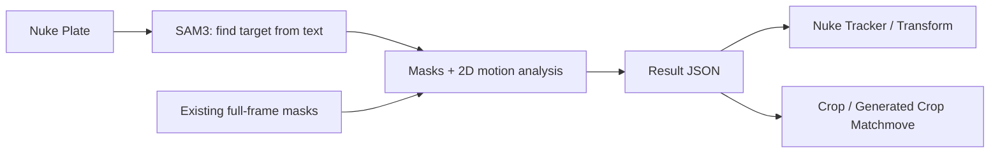

# SAM3 Matchmove for Nuke

**Find an object with text. Bring its motion into Nuke Tracker.**

[한국어](README.md) · [English](README.en.md)

`Tested in Nuke 17.0v3` · `Windows` · `SAM3` · `2D Object Matchmove`

https://github.com/user-attachments/assets/72ade68a-44d2-4ede-9832-d4da3031d503

*10-second edited demo: originals, SAM3 masks, stabilized crops, and native Nuke nodes for a ball, car, and face.*

This tool uses SAM3 object recognition to find a subject in footage and export motion from that region as **native Nuke Tracker, Transform, and Crop nodes**. Enter a target such as `face` or `red car`, run the analysis, then continue working with Reference and Export in Nuke.

**SAM3 analysis takes time.** It requires model loading and mask inference across frames, and the wait depends on clip length, resolution, and GPU. Starting with an object description brings **target selection → motion analysis → Nuke node creation** into one workflow, making it easier to prepare object-based matchmoves and place generated footage back into the original plate.

[Requirements](#requirements) · [Installation](#installation-windows) · [Workflow](#workflow) · [Outputs](#outputs) · [Detailed guide (Korean)](docs/USAGE.md)

---

## What can you use it for?

| Task | How it helps |
| --- | --- |
| Object-based 2D matchmove | Extract translation and scale for a target described in text. Features mode also estimates rotation. |
| Adjusting results in Nuke | Export a native Tracker, change its Reference, and create linked Transforms. |
| Preparing crops for generation or editing | Extract the target region at a chosen aspect ratio and size. The default is `720×720`, `1:1`. |
| Placing generated footage into the plate | Return generated or edited footage matching the crop size to the original plate coordinates. |
| Reusing existing masks | Analyze full-frame masks from other tools with Input mask mode. |



SAM3 produces target masks; the plugin uses those masks and the source footage to calculate 2D motion. It does not perform a 3D camera solve or estimate a face's 3D pose.

## Requirements

> [!IMPORTANT]
> **The tested Nuke 17.0v3 installation uses Python 3.11.11, while official SAM3 requires Python 3.12 or later.**
> The tool therefore **runs inference in a separate Python environment and returns the results to Nuke**. Registering the Nuke nodes and preparing the SAM3 runtime are separate setup steps.

| Component | Role / preparation |
| --- | --- |
| Nuke | Node UI, input preparation, and Tracker, Transform, and Read creation. **Tested in Nuke 17.0v3 / Python 3.11.11.** |
| External Worker Python | SAM3 inference and motion analysis. **Python 3.12 is recommended**; the tested version is 3.12.9. |
| GPU | SAM3 text mode requires an NVIDIA GPU with CUDA support. |
| Windows setup script | Installs a separate `.venv-sam3`, CUDA PyTorch, and official SAM3 source. Install Git and 64-bit Python 3.12 first. |
| Model | Requires the official `sam3.pt` checkpoint. Request access on Hugging Face before downloading. |
| Input mask mode | Can analyze masks without SAM3 weights using an external Python environment with NumPy, OpenCV, and Pillow. |

See the [Meta SAM3 installation instructions](https://github.com/facebookresearch/sam3#installation) for upstream requirements. The Windows setup script uses the tested combination of SAM3 source revision and PyTorch. Other Nuke versions, operating systems, and GPUs need separate validation.

## Installation (Windows)

### 1. Get the repository

```powershell
git clone https://github.com/tardis7732/SAM3-Matchmove-for-Nuke.git
cd SAM3-Matchmove-for-Nuke
```

This folder becomes the Nuke plugin installation location. Keep it in place after installation.

### 2. Create the SAM3 environment

Replace the example path below with **the actual `python.exe` path of your separately installed Python 3.12**. Do not point it at the Python inside your Nuke installation.

```powershell
.\scripts\setup_sam3.ps1 -PythonExe 'C:\Python312\python.exe'
```

The script installs dependencies into `.venv-sam3` and configures Worker Python in `config.local.json`. The initial package download and installation take time.

### 3. Download the SAM3 model

After obtaining access on the [facebook/sam3 model page](https://huggingface.co/facebook/sam3), run:

```powershell
.\scripts\auth_sam3.ps1
```

After Hugging Face authentication, the script downloads the official checkpoint to `checkpoints/sam3.pt`. **Runtime installation and model download are separate steps.** If you already have the model, you can also set its path in Nuke under `Environment → SAM3 checkpoint`.

### 4. Register the plugin in Nuke

```powershell
.\scripts\install_nuke.ps1
```

Restart Nuke and create the node with **Tab → SAM3 Matchmove**, or **Nodes → AI → SAM3 Matchmove**. Use `Environment → Check Worker Environment` to check your setup. This checks dependencies; actual footage inference runs when you use Analyze.

The installer backs up the existing `.nuke/init.py` before adding the plugin path. For blocked `.ps1` execution or connecting an existing worker environment, see the [additional installation guide (Korean)](docs/USAGE.md#설치-보충).

## Workflow

1. Connect the source or the final node of your processing chain to **Plate(0)**.
2. Set the range with **First / Last / Reset**, then choose a **Reference** frame where the target is clearly visible.
3. Set **Mask source = SAM3 text** and describe the target, for example **Target text = face**.
4. Click **Analyze**. If the input needs conversion, the tool creates a PNG Write node. **Render it manually, then click Analyze again.**
5. Follow model loading, mask generation, and motion analysis in the progress popup. When analysis finishes, an RGBA mask Read is connected to the Mask input and a Result JSON is saved.
6. Choose the desired **Output** and click **Export**. The default is **Tracker**.

The original Plate connection and `SAM3 text` setting remain after analysis. To edit the masks and analyze them again, select `Input mask` yourself. **Export uses the saved JSON, so exporting another output type from the same result does not rerun SAM3.**

### What about EXR, Retime, or intermediate nodes?

When a Read with a supported format is connected directly, the tool reads the original files. For EXR or input after Retime, Grade, or Transform, it prepares **a Write node that renders the processed result to PNG**. To include upstream changes, render that Write again before running Analyze.

- Direct image input: JPG/JPEG, PNG, BMP, TIFF (`.tiff`), WEBP.
- Direct video input: MP4, MOV, AVI, MKV, WEBM. Both Nuke and the worker need codec support; time changes and similar processing use rendered input.

## Outputs

| Output | Created nodes / connection |
| --- | --- |
| **Tracker** · default | Native Nuke Tracker4. Change Reference and use its built-in Export to create linked Transforms. |
| **Matchmove** | A Transform for an insert aligned to the plate coordinates at the reference frame. Connect the insert yourself. |
| **Stabilize** | A Transform applying the inverse motion to the original plate. |
| **Plate Stabilize Crop** | Transform + Reformat extracting the target region from the plate at Width×Height. |
| **Generated Crop Matchmove** | Transform + Reformat returning generated or edited footage of the same crop size to the original plate coordinates and resolution. |
| **Mask Read** | Creates only a Read for the saved RGBA masks. It does not connect it automatically. |

Analysis saves masks with **R=G=B=A**, so no additional Shuffle is needed. Crop supports aspect-ratio presets, a ratio lock, and independent width/height entry. Use the same dimensions for both crop outputs.

### Changing Reference later

Create a **linked output** with `Tracker → built-in Export → Transform (match-move)` or `Transform (stabilize)`. Changing the Tracker's Reference then updates the Transform. `baked` outputs and Matchmove/Stabilize exported directly from the SAM3 node have fixed curves.

The four Tracker points are virtual coordinates constructed to reproduce the analyzed translation, rotation, and scale. They are not four independently tracked feature points.

## Speed and results

- **Analysis wait time and ease of use are separate considerations.** The tool connects object selection and node creation in one workflow, but does not promise real-time processing or a shorter total working time on every shot.
- The default **BBox** mode calculates translation and scale from mask center and size; rotation is zero. **Features** mode uses image features inside the mask to estimate 2D rotation as well.
- **Rotation estimates can be inaccurate.** The 2D angle is estimated from image features within the SAM3-masked region, so mask changes, occlusion, motion blur, and changes in the subject's pose can introduce errors or jitter. Check a short range first, and disable rotation or correct it manually when needed.
- Existing masks must match the plate's **resolution, coordinates, and frames**. Restore cropped masks to the original plate space before using them.
- This tracker does not solve nonrigid changes in generated footage, perspective deformation, or 3D rotation. Review and adjust the output for your shot.

## References

This is a standalone tool that brings the object tracking, crop, and placement workflow from [Wan Animate + SAM3 Head for Nuke](https://github.com/tardis7732/wan-animate-sam3-head-for-nuke) into Nuke nodes. It does not require ComfyUI or Wan to run.

- [Meta SAM3 — official code](https://github.com/facebookresearch/sam3)
- [SAM3 — official model](https://huggingface.co/facebook/sam3)
- [Reference projects and API notes (Korean)](docs/references.md)

This is not an official Meta or Foundry plugin. SAM3 code and weights remain subject to the upstream license and model terms. Model weights and external runtimes are not included in this repository.
