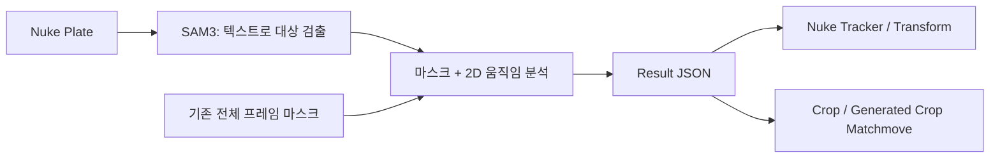

# SAM3 Matchmove for Nuke

**대상을 텍스트로 찾고, 움직임을 Nuke Tracker로.**

[한국어](README.md) · [English](README.en.md)

`Nuke 17.0v3에서 검증` · `Windows` · `SAM3` · `2D Object Matchmove`

https://github.com/user-attachments/assets/72ade68a-44d2-4ede-9832-d4da3031d503

*10초 편집 데모: 공·차량·얼굴의 원본, SAM3 마스크, 안정화 Crop과 Nuke 노드 구성.*

SAM3의 객체 인식을 이용해 영상 속 대상을 찾고, 그 영역에서 얻은 움직임을 **Nuke 기본 Tracker·Transform·Crop**으로 내보내는 도구입니다. `face`, `red car`처럼 추적할 대상을 입력하고 분석한 뒤, Nuke에서 Reference와 Export를 이어서 다룰 수 있습니다.

**SAM3 분석에는 시간이 걸립니다.** 모델 로딩과 프레임별 마스크 추론이 필요하며, 영상 길이·해상도·GPU에 따라 대기 시간이 달라집니다. 대신 객체를 지정하는 것부터 시작해 **대상 영역 선택 → 움직임 분석 → Nuke 노드 생성**을 한 흐름으로 진행할 수 있어, 객체 중심의 매치무브와 생성 영상의 원위치 배치를 간편하게 준비할 수 있습니다.

[실행 환경](#실행-환경) · [설치](#설치-windows) · [사용 순서](#사용-순서) · [출력 종류](#출력-종류) · [상세 가이드](docs/USAGE.md)

---

## 어떤 작업에 쓰나요?

| 작업 | 활용 |
| --- | --- |
| 객체 중심의 2D 매치무브 | 텍스트로 지정한 대상의 이동·스케일을 얻고, Features 모드에서는 회전도 추정합니다. |
| Nuke에서 결과 조정 | 기본 Tracker로 내보낸 뒤 Reference를 바꾸고 연동 Transform을 만듭니다. |
| 생성·수정용 Crop 준비 | 대상 주변을 지정한 화면비와 크기로 추출합니다. 기본은 `720×720`, `1:1`입니다. |
| 생성 결과를 원본에 배치 | Crop 크기에 맞춘 생성·수정 영상을 원래 Plate 좌표로 되돌립니다. |
| 기존 마스크 재사용 | 다른 도구에서 만든 전체 프레임 마스크도 Input mask로 분석할 수 있습니다. |



SAM3는 대상 마스크를 만들고, 플러그인은 그 마스크와 원본 영상을 이용해 2D 움직임을 계산합니다. 3D camera solve나 얼굴의 3D pose를 계산하는 도구는 아닙니다.

## 실행 환경

> [!IMPORTANT]
> **검증한 Nuke 17.0v3의 내장 Python은 3.11.11이고, 공식 SAM3는 Python 3.12 이상을 요구합니다.**
> 따라서 **별도의 Python 환경에서 추론한 결과를 Nuke가 받아오는 구조**입니다. Nuke 노드 등록과 SAM3 실행 환경 준비가 각각 필요합니다.

| 구분 | 역할 / 준비 사항 |
| --- | --- |
| Nuke | 노드 UI, 입력 준비, Tracker·Transform·Read 생성. **Nuke 17.0v3 / Python 3.11.11에서 검증**했습니다. |
| 외부 Worker Python | SAM3 추론과 움직임 분석. **Python 3.12 권장**, 실제 검증은 3.12.9입니다. |
| GPU | SAM3 text 모드는 CUDA를 지원하는 NVIDIA GPU가 필요합니다. |
| Windows 설치 스크립트 | 별도 `.venv-sam3`와 CUDA PyTorch·공식 SAM3 소스를 설치합니다. Git과 64비트 Python 3.12를 먼저 준비하세요. |
| 모델 | 공식 `sam3.pt`가 필요합니다. Hugging Face에서 모델 접근 승인을 받은 뒤 다운로드합니다. |
| Input mask 모드 | SAM3 가중치 없이 NumPy·OpenCV·Pillow가 있는 외부 Python으로 분석할 수 있습니다. |

공식 요구 사항은 [Meta SAM3 설치 안내](https://github.com/facebookresearch/sam3#installation)를 참고하세요. Windows 설치 스크립트는 검증한 SAM3 소스 버전과 PyTorch 조합을 사용합니다. 다른 Nuke 버전·운영체제·GPU에서의 동작은 별도 확인이 필요합니다.

## 설치 (Windows)

### 1. 저장소 받기

```powershell
git clone https://github.com/tardis7732/SAM3-Matchmove-for-Nuke.git
cd SAM3-Matchmove-for-Nuke
```

이 폴더가 Nuke 플러그인 설치 경로가 됩니다. 설치 후에도 폴더를 유지하세요.

### 2. SAM3 실행 환경 만들기

아래 예시 경로를 **별도로 설치한 Python 3.12의 실제 `python.exe` 경로**로 바꿔 실행합니다. Nuke 설치 폴더의 Python을 지정하지 마세요.

```powershell
.\scripts\setup_sam3.ps1 -PythonExe 'C:\Python312\python.exe'
```

`.venv-sam3`에 의존성을 설치한 뒤 `config.local.json`에 Worker Python을 연결합니다. 처음에는 패키지 다운로드와 설치 시간이 필요합니다.

### 3. SAM3 모델 받기

[facebook/sam3 모델 페이지](https://huggingface.co/facebook/sam3)에서 접근 승인을 받은 뒤 실행합니다.

```powershell
.\scripts\auth_sam3.ps1
```

Hugging Face 로그인 후 공식 체크포인트를 `checkpoints/sam3.pt`로 다운로드합니다. **실행 환경 설치와 모델 다운로드는 별도 단계**입니다. 이미 받은 모델은 Nuke의 `Environment → SAM3 checkpoint`에서 지정할 수도 있습니다.

### 4. Nuke에 등록하기

```powershell
.\scripts\install_nuke.ps1
```

Nuke를 재시작하고 **Tab → SAM3 Matchmove**, 또는 **Nodes → AI → SAM3 Matchmove**로 생성합니다. `Environment → Check Worker Environment`로 환경을 확인하세요. 이 검사는 의존성을 점검하며 실제 영상 추론은 Analyze에서 수행합니다.

기존 `.nuke/init.py`는 백업한 뒤 플러그인 경로를 추가합니다. `.ps1` 실행이 차단되는 경우와 기존 Worker 환경을 연결하는 방법은 [상세 설치 가이드](docs/USAGE.md#설치-보충)를 참고하세요.

## 사용 순서

1. 원본 또는 처리된 마지막 노드를 **Plate(0)**에 연결합니다.
2. **First / Last / Reset**으로 범위를 정하고, 대상이 잘 보이는 **Reference** 프레임을 선택합니다.
3. **Mask source = SAM3 text**, **Target text = face** 등으로 대상을 지정합니다.
4. **Analyze**를 누릅니다. 입력 변환이 필요하면 PNG Write가 생성됩니다. **직접 렌더한 뒤 Analyze를 다시 누르세요.**
5. 진행 팝업에서 모델 로딩·마스크 생성·움직임 분석을 확인합니다. 완료되면 RGBA 마스크 Read가 Mask 입력에 연결되고 Result JSON이 저장됩니다.
6. **Output**에서 필요한 종류를 선택하고 **Export**합니다. 기본값은 **Tracker**입니다.

분석 후에도 원본 Plate 연결과 `SAM3 text` 설정은 유지됩니다. 마스크를 수정해 다시 분석하려면 `Input mask`를 직접 선택하세요. **Export는 저장된 JSON을 사용하므로, 같은 결과를 다른 종류로 내보낼 때 SAM3를 다시 실행하지 않습니다.**

### EXR·Retime·중간 노드가 있으면?

지원 포맷의 Read가 직접 연결돼 있으면 원본 파일을 읽습니다. EXR이나 Retime·Grade·Transform 뒤의 입력은 **처리된 결과를 PNG로 렌더할 Write**를 준비합니다. 앞단 변경을 반영하려면 그 Write를 다시 렌더하고 Analyze하세요.

- 직접 입력 이미지: JPG/JPEG, PNG, BMP, TIFF(`.tiff`), WEBP.
- 직접 입력 영상: MP4, MOV, AVI, MKV, WEBM. Nuke와 Worker의 코덱 지원이 필요하며, 시간 변경 등은 렌더 입력을 사용합니다.

## 출력 종류

| Output | 생성 결과 / 연결 |
| --- | --- |
| **Tracker** · 기본 | Nuke 기본 Tracker4. Reference 변경과 기본 Export로 연동 Transform을 만듭니다. |
| **Matchmove** | 기준 프레임의 Plate 좌표에 맞춘 삽입 이미지에 적용할 Transform. 입력 영상을 직접 연결합니다. |
| **Stabilize** | 원본 Plate에 역변환을 적용하는 Transform. |
| **Plate Stabilize Crop** | 원본에서 대상 주변을 Width×Height 크기로 추출하는 Transform + Reformat. |
| **Generated Crop Matchmove** | 같은 크기의 생성·수정 영상을 원래 Plate 좌표와 해상도로 복원하는 Transform + Reformat. |
| **Mask Read** | 저장된 RGBA 마스크 Read만 생성합니다. 자동 연결하지 않습니다. |

분석 시 마스크는 **R=G=B=A**로 저장되므로 별도 Shuffle이 필요 없습니다. Crop은 화면비 프리셋·비율 잠금·독립적인 폭/높이 입력을 지원하며, 두 Crop 출력에는 같은 크기를 사용하세요.

### Reference를 나중에 바꾸려면

`Tracker → 기본 Export → Transform (match-move)` 또는 `Transform (stabilize)`로 **연동 출력**을 만드세요. 이후 Tracker의 Reference를 바꾸면 Transform도 갱신됩니다. `baked` 출력과 SAM3에서 직접 내보낸 Matchmove·Stabilize는 고정 곡선입니다.

Tracker의 포인트 4개는 분석한 이동·회전·스케일을 재현하도록 만든 가상 좌표입니다. 각각을 독립적으로 추적한 특징점 데이터는 아닙니다.

## 속도와 결과에 대해

- **분석 대기 시간과 수작업 편의성은 별개입니다.** 객체 지정과 노드 생성을 간편하게 연결하지만, 실시간 처리나 모든 샷에서의 작업 시간 단축을 보장하지는 않습니다.
- 기본 **BBox** 모드는 마스크 중심·크기로 이동과 스케일을 계산하며 회전은 0입니다. **Features** 모드는 마스크 안의 영상 특징점으로 2D 회전까지 추정합니다.
- **회전값은 부정확할 수 있습니다.** SAM3 마스크로 제한한 영역 안의 영상 특징점에서 추정하는 2D 값이므로, 마스크 변화·가림·모션 블러·대상의 자세 변화에 따라 오차나 흔들림이 생길 수 있습니다. 짧은 구간부터 결과를 확인하고, 필요하면 회전을 끄거나 수동 보정하세요.
- 기존 마스크는 **Plate와 해상도·좌표·프레임이 일치**해야 합니다. 잘린 Crop 마스크는 원래 Plate 공간으로 복원한 뒤 사용합니다.
- 생성형 영상의 비강체 변화, 원근 변형, 3D 회전까지 해결하는 트래커는 아닙니다. 출력 후 샷에 맞는 확인과 보정이 필요합니다.

## 참고

이 프로젝트는 [Wan Animate + SAM3 Head for Nuke](https://github.com/tardis7732/wan-animate-sam3-head-for-nuke)에서 사용한 객체 추적·Crop·원위치 복원 흐름을 Nuke 노드 작업으로 옮긴 독립 도구입니다. ComfyUI나 Wan을 실행할 필요는 없습니다.

- [Meta SAM3 — 공식 코드](https://github.com/facebookresearch/sam3)
- [SAM3 — 공식 모델](https://huggingface.co/facebook/sam3)
- [참고 프로젝트와 API 기록](docs/references.md)

Meta·Foundry의 공식 플러그인은 아닙니다. SAM3 코드와 가중치는 원 프로젝트의 라이선스 및 모델 이용 조건을 따르며, 이 저장소에는 모델 가중치와 외부 런타임을 포함하지 않습니다.
